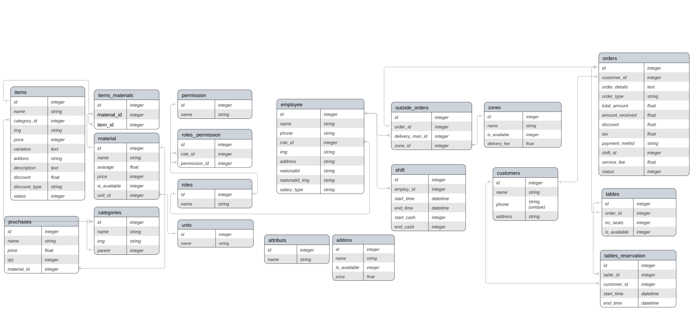

## Migrations with SQL

Laravel Migrations Using SQL Query and composer package that take the SQL Query and create migrations for you.


## Steps

- Copy the SQL Query from the migration.sql file

- Create a database with any name int phpMyAdmin
- Paste the SQL query in it and run it
- Configure your database with you Laravel project
- Install the following package [laravel-migrations-generator](https://github.com/kitloong/laravel-migrations-generator)

- Run the following command inside your Laravel project

```bash
  composer require --dev kitloong/laravel-migrations-generator
```
- Run this command to generate all the migration files 
```bash
php artisan migrate:generate
```

## Database ERD


 

